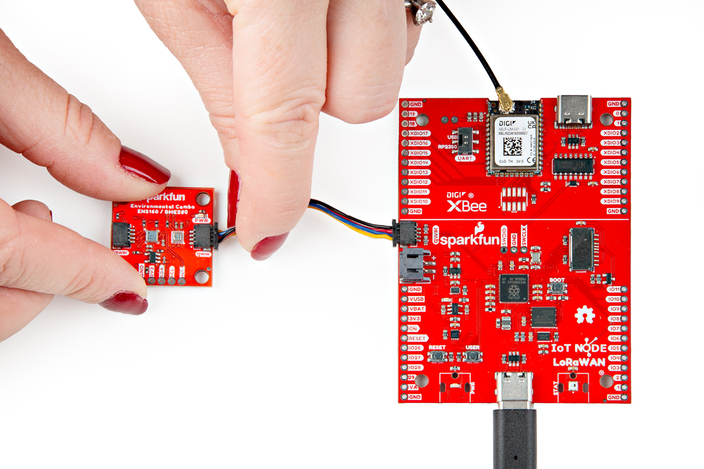
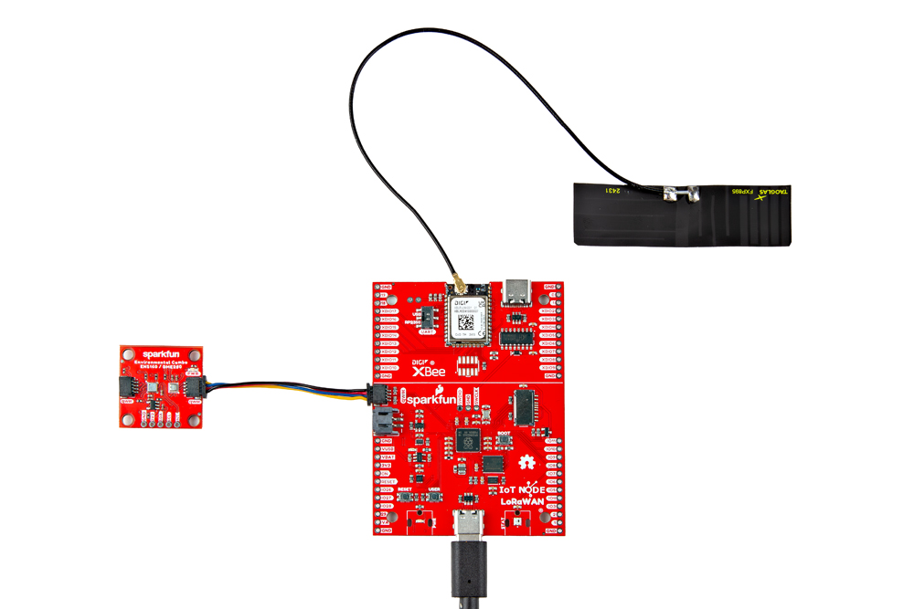

Using the Qwiic system, assembling the hardware is simple. Connect the Qwiic sensor to the LoRaWAN board using a Qwiic cable. Then connect the LoRaWAN to your computer via the USB-C cable.  

<figure markdown>
[{ width="75%" }](assets/img/26060-LoRaWAN-QwiicBoard.jpg "Click to enlarge")
<figcaption markdown>Connecting a Qwiic Sensor to the IoT Node - LoRaWAN Board</figcaption>
</figure>

You'll also need to connect your antenna to the XBee module on the board like so: 

<figure markdown>
[{ width="75%" }](assets/img/26060-LoRaWAN-Action-4.jpg "Click to enlarge")
<figcaption markdown>Antenna Connected to XBee module</figcaption>
</figure>

