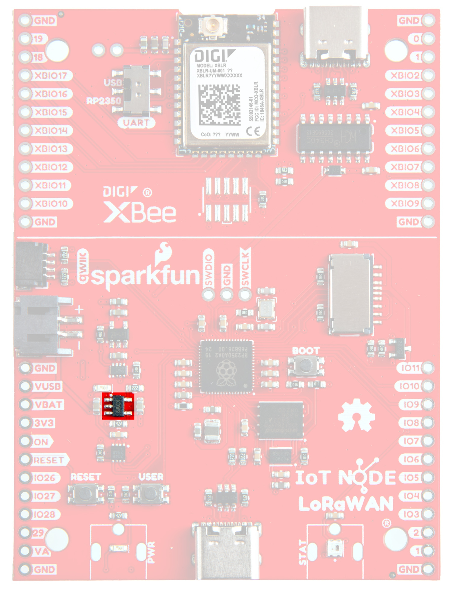

 
## XBee LR LoRaWAN® Module

The XBee® LR from Digi® is a wireless communications module that supports the LoRaWAN® communications protocol, enabling direct communication with standards-compliant LoRaWAN® gateways and Network Server cloud software over long range with very low-power consumption. It comes pre-activated with Digi® X-ON™ - a complete device-to-cloud platform for connected IoT devices which provides a simplified Digi® Embedded API and AT command interpreter to interface with your sensor over serial. Scanning the QR Code on the module will take you directly to the Digi® X-ON™ cloud platform for automated connection and two-way device management. For more information, refer to the [datasheet](assets/component_documentation/Digi-XBLR-Datasheet.pdf).

ISM 902 to 928 MHz, 868 to 870 MHz
LoRaWAN® 1.0.4, OTAA, ABP

<figure markdown>
[{ width="50%" }](assets/img/26060-IoT-Node-LoRaWAN-XBLR.jpg "Click to enlarge")
<figcaption markdown>XBee LR LoRaWAN® Module</figcaption>
</figure>

## RP2350

The RP2350 is part of a new family of microcontrollers from Raspberry Pi that offers significant enhancements over RP2040. Along with the Dual ARM M33/RISC-V Hazard 3 CPU core running at a frequency of 150MHz and double the amount of internal RAM, the RP2350 also includes 8MB of PSRAM as well as a host of peripherals. As shipped, the SparkFun IoT Node for LoRaWAN® board makes use of the ARM M33 Core, but the user has the option to change to the RISC-V Hazard 3 CPU Core. More information can be found in the datasheet [here](assets/component_documentation/).

<figure markdown>
[{ width="50%" }](assets/img/26060-IoT-Node-LoRaWAN-RP2350.jpg "Click to enlarge")
<figcaption markdown>RP2350</figcaption>
</figure>

## Power & Voltage Regulation

While max input power is 5.5V for the board, the LM66200 regulates the voltage down to 3.3 for the majority of the components on the board. 

<figure markdown>
[{ width="50%" }](assets/img/26060-IoT-Node-LoRaWAN-VoltageRegulator.jpg "Click to enlarge")
<figcaption markdown>LM66200</figcaption>
</figure>

## Qwiic connector

The Qwiic connector on the side of the board provides power and I2C connectivity simultaneously to our rich array of Qwiic sensors. More information on our Qwiic Ecosystem [can be found here](https://www.sparkfun.com/qwiic). 

<figure markdown>
[{ width="50%" }](assets/img/26060-IoT-Node-LoRaWAN-QwiicConnex.jpg "Click to enlarge")
<figcaption markdown>Qwiic connector</figcaption>
</figure>

## XBLR UART Selection Switch

This selection switch allows you to choose whether you talk to the XBee LR via the Raspberry Pi or the USB connector at the top of the board. Unless there is a need to talk to the XBee directly (ie, debugging, etc), it is recommended to leave the switch on the RP2350.

<figure markdown>
[{ width="50%" }](assets/img/26060-IoT-Node-LoRaWAN-UART-Switch.jpg "Click to enlarge")
<figcaption markdown>UART Selection Switch</figcaption>
</figure>

## RP2350 Debug Header

Should you need breakpoint level debugging, we've broken out a debug header for the RP2350. Standard pinout for the ARM Cortex. 

<figure markdown>
[{ width="50%" }](assets/img/26060-IoT-Node-LoRaWAN-RP2350_DebugHeaders.jpg "Click to enlarge")
<figcaption markdown>RP2350 Debug Header</figcaption>
</figure>

## XBee LR Debug Header

Similar to the debug header for the RP2350, these pads allow for breakpoint level debugging of the XBee module. Unlike the RP2350 Debug Header, however, these pads are unpopulated. 

<figure markdown>
[{ width="50%" }](assets/img/26060-IoT-Node-LoRaWAN-XBLR_DebugHeader.jpg "Click to enlarge")
<figcaption markdown>XBee LR Debug Header</figcaption>
</figure>

## MicroSD Card

The microSD card slot allows for data logging or for more advanced users, easy upload of firmware programming files for the Raspberry Pi.

!!! warning
	Do NOT drive the microSD card pins high if the card is not powered. Damage could occur! 

<figure markdown>
[{ width="50%" }](assets/img/26060-IoT-Node-LoRaWAN-microSD-Slot.jpg "Click to enlarge")
<figcaption markdown>microSD Card Slot</figcaption>
</figure>

## Battery Charging Circuit

The MCP73831 has been integrated to allow for charging of a LiPo Battery via the JST connector. 

<figure markdown>
[{ width="50%" }](assets/img/26060-IoT-Node-LoRaWAN-ChargeCircuit.jpg "Click to enlarge")
<figcaption markdown>MCP73831</figcaption>
</figure>

Charging occurs at a rate of 455mA. Our calculation of this rate is via the equation below: 

<figure markdown>
[{ width="100%" }](assets/img/chargeCircuitEquations.jpg "Click to enlarge")
<figcaption markdown>Charge Circuit Equation</figcaption>
</figure>

## Buttons

<figure markdown>
[{ width="50%" }](assets/img/26060-IoT-Node-LoRaWAN-Buttons.jpg "Click to enlarge")
<figcaption markdown>Boot, Reset, and User Buttons</figcaption>
</figure>

* <b>Boot:</b>
	Pressing and holding the boot button will set the board into boot select mode. This sets up as a mass storage device, which allows for drag-and-drop functionality for uploading uf2 programming files. For more information about the UF2 Bootloader, refer to the [Software/Bootloader](./uf2.md) section of this tutorial. 
* <b>Reset:</b>
	The reset button does a software reset on the RP2350. 
* <b>User Button:</b>
	The User Button is a user-defined general use button connected to GPIO. 

## Jumpers

??? note "Never modified a jumper before?"
	Check out our <a href="https://learn.sparkfun.com/tutorials/664">Jumper Pads and PCB Traces tutorial</a> for a quick introduction!
	

		<a href="https://learn.sparkfun.com/tutorials/664">
		 
        How to Work with Jumper Pads and PCB Traces</a>
	

<figure markdown>
[{ width="50%" }](assets/img/26060-IoT-Node-LoRaWAN-Jumpers.jpg "Click to enlarge")
<figcaption markdown>Jumpers</figcaption>
</figure>

* <b>XB_SHLD: </b>
	For most applications, single point grounding is sufficient. However, should you run into problems with EMI/EMC, we've provided a jumper that allow you to disconnect the XBee connector from ground.
* <b>XB_MEAS: </b>
	Cut this trace to measure the current consumed by the XBee LR. 
* <b>LP:</b>
	Cut the LP trace to make the microSD card and the RGB LED powered off by default. This functionality can then be controlled by GPIO. 
* <b>CHG:</b>
	Cut the CHG trace to disable the CHG LED. 
* <b>SHLD:</b>
	Should you run into problems with EMI/EMC, we've provided a jumper that allow you to disconnect the USB Shield from ground.
* <b>PWR:</b>
	Cut the PWR trace to disable the Power LED. 
* <b>I2C:</b>
	The SparkFun IoT Node for LoRaWAN® board has built-in 2.2k pull-up resistors on the SDA and SCL lines. These are needed for normal I2C communication. The I2C jumper has two small traces connecting the pull-ups to 3.3V. **For general use you can leave this jumper unmodified.** If you have many (over 7) devices on the I2C bus, each with their own pull up resistors, then you may want to [cut the I2C jumpers](https://learn.sparkfun.com/tutorials/how-to-work-with-jumper-pads-and-pcb-traces) to disconnect the 2.2k resistors on each Qwiic board.

## Board Dimensions

The board dimensions are illustrated in the drawing below; the listed measurements are in millimeters.

<figure markdown>
[{ width="75%" }](assets/img/26060_SparkFun_IOT_Node_LoRaWAN-BoardOutline.jpg "Click to enlarge")
<figcaption markdown>SparkFun IoT Node for LoRaWAN® Board Dimensions</figcaption>
</figure>

	
??? tip "Need more measurements?"
	For more information about the board's dimensions, users can download the [KiCad files](../assets/board_files/SparkFun_IoT_Node_LoRaWAN_KiCADFiles.zip) for the board. These files can be opened in KiCad and additional measurements can be made with the dimensions tool.

	??? info ":octicons-download-16:{ .heart } Eagle - Free Download!"
		KiCAD is a [CAD]("computer-aided design") program for electronics that is free to use for hobbyists and students. However, it does require an account registration to utilize the software.

		

		[Download from :autodesk-primary:{ .autodesk }](https://www.kicad.org/download/ "Go to downloads page"){ .md-button .md-button--primary width="250px" }
		

	
