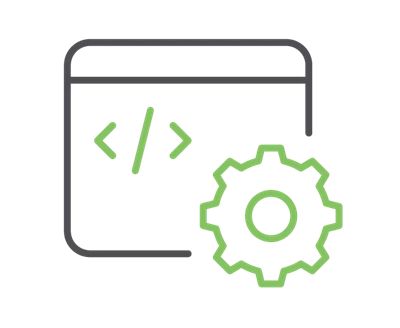

-    <a href="https://www.sparkfun.com/products/26060">
    **SparkFun IoT Node - LoRaWAN** 
    **SKU:** WRL-26060

    ---

    <figure markdown>
    
    </figure></a>
    
-    The SparkFun IoT Node - LoRaWAN is a dual-action board that combines the exceptional LoRaWAN capabilities of the Digi XBee LR module with the RP2350 - a new family of microcontrollers from Raspberry Pi that offers significant enhancements over the RP2040 line. With Digi's Scan and Go Provisioning App, you'll have a data-ready device solution from development to operation up and running in no time.

    Digi XBee LR modules are pre-activated on the Digi X-ON cloud platform for automated connection and two-way device management. The Digi XBee LR module provides a simplified Digi Embedded API and AT command interpreter to interface with your sensor over serial.

[Purchase from SparkFun :fontawesome-solid-cart-plus:{ .heart }](https://www.sparkfun.com/products/26060){ .md-button .md-button--primary }

## Required Materials

To follow along with this tutorial, you will need the following materials. You may not need everything, depending on what you have. Add it to your cart, read through the guide, and adjust the cart as necessary.

<table style="border-style:none">
    <tr>
        <td>
            <a href="https://www.sparkfun.com/products/26060">
                

                <h3 class="title">SparkFun IoT Node - LoRaWAN</h3>
            </a>
            WRL-26060
        </td>
    </tr>
</table>

## Suggested Reading

Below are a few tutorials that may help users familiarize themselves with various aspects of the board.

-   <a href="https://learn.sparkfun.com/tutorials/how-to-solder-through-hole-soldering">
    <figure markdown>
    
    </figure>
    </a>
    <a href="https://learn.sparkfun.com/tutorials/how-to-solder-through-hole-soldering">**How to Solder: Through-Hole Soldering**
    </a>

-   <a href="https://learn.sparkfun.com/tutorials/sending-sensor-data-over-lora">
    <figure markdown>
    
    </figure>
    </a>
    <a href="https://learn.sparkfun.com/tutorials/sending-sensor-data-over-lora">**Sending Sensor Data over LoRa**
    </a>

-   <a href="https://learn.sparkfun.com/tutorials/534">
    <figure markdown>
    
    </figure>
    </a>
    <a href="https://learn.sparkfun.com/tutorials/534">**Connectivity of the Internet of Things**
    </a>

-   <a href="https://learn.sparkfun.com/tutorials/lorawan-with-prorf-and-the-things-network">
    <figure markdown>
    
    </figure>
    </a>
    <a href="https://learn.sparkfun.com/tutorials/lorawan-with-prorf-and-the-things-network">**LoRaWAN with ProRF and The Things Network**
    </a>
-   <a href="https://hub.digi.com/support/products/xctu/">
    <figure markdown>
    
    </figure>
    </a>
    <a href="https://hub.digi.com/support/products/xctu/">**X-CTU Software**
    </a>

    

        

            
        

    

The SparkFun IoT Node - LoRaWAN takes advantage of the [Qwiic connect system](https://www.sparkfun.com/qwiic). We recommend familiarizing yourself with the **Logic Levels** and **I2C** tutorials.  Click on the banner above to learn more about [Qwiic products](https://www.sparkfun.com/qwiic).

    <iframe width="600" height="327" src="https://www.youtube.com/embed/x0RDEHqFIF8" title="SparkFun's Qwiic Connect System" frameborder="0" allow="accelerometer; autoplay; clipboard-write; encrypted-media; gyroscope; picture-in-picture" allowfullscreen></iframe>

