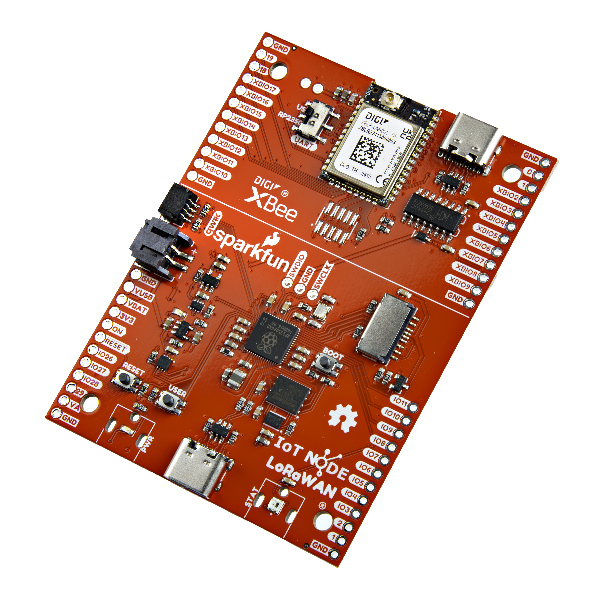
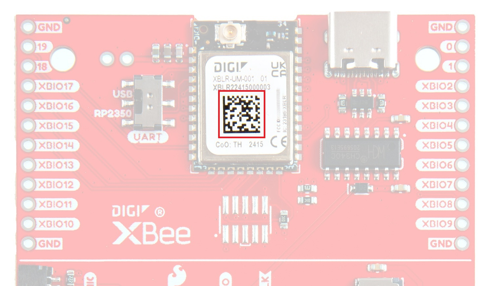
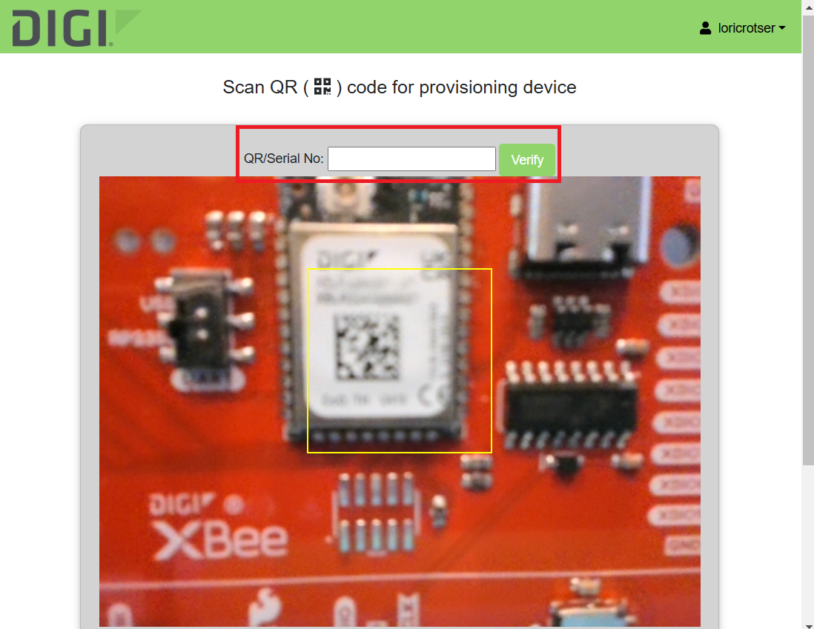
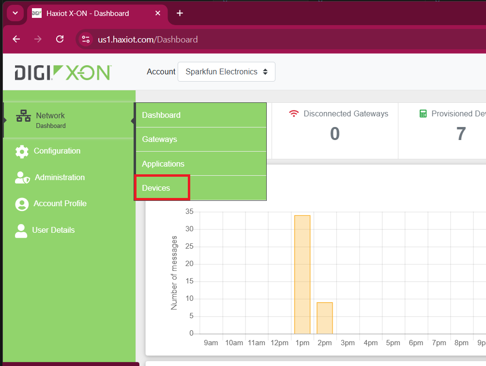
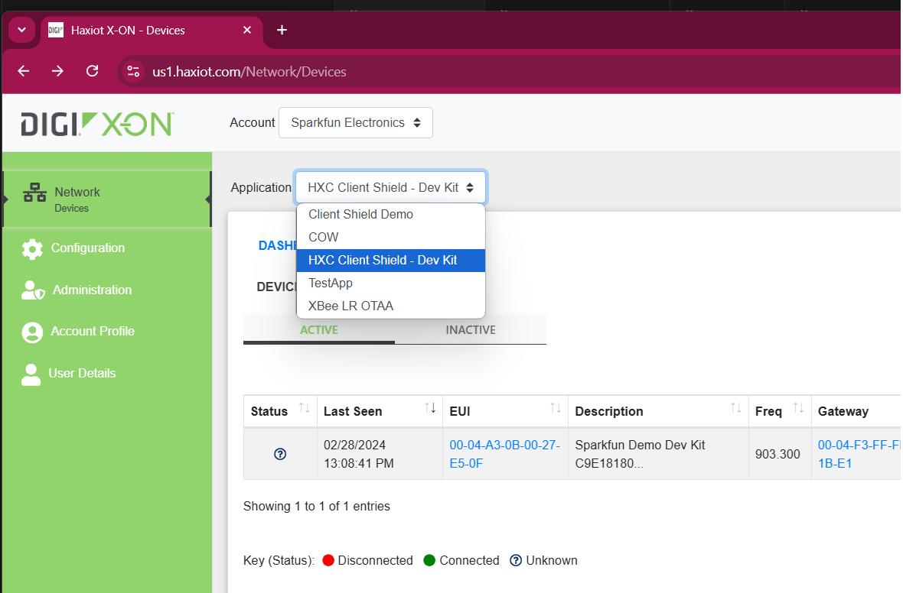
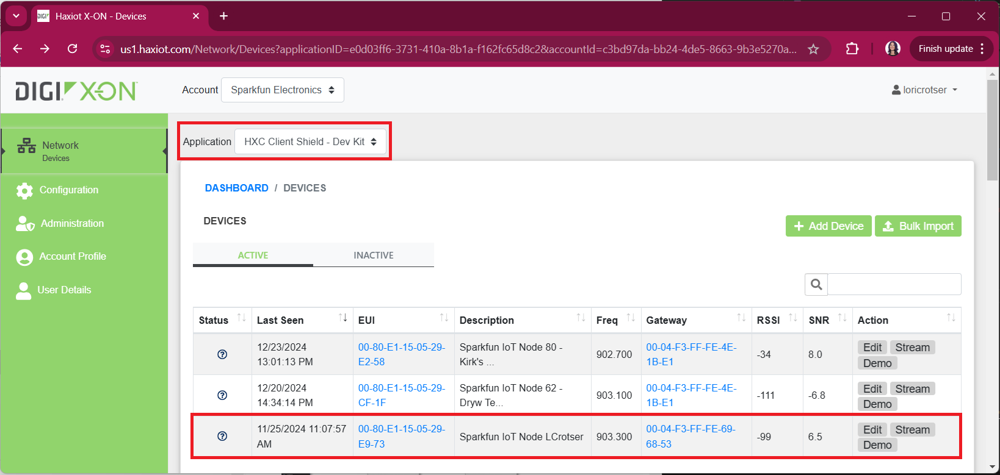
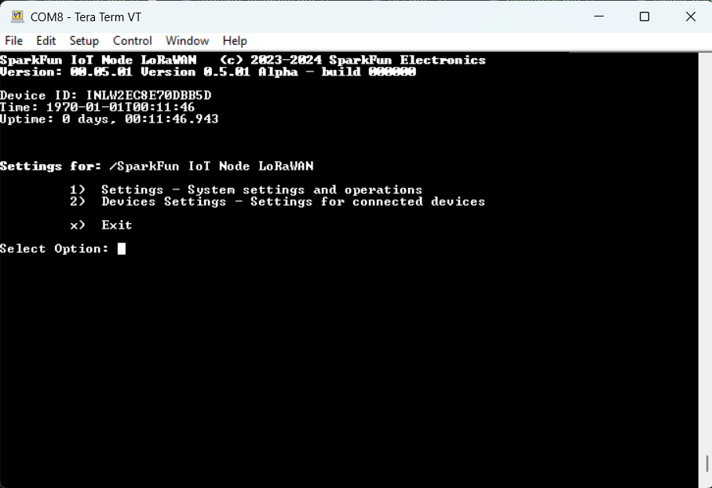
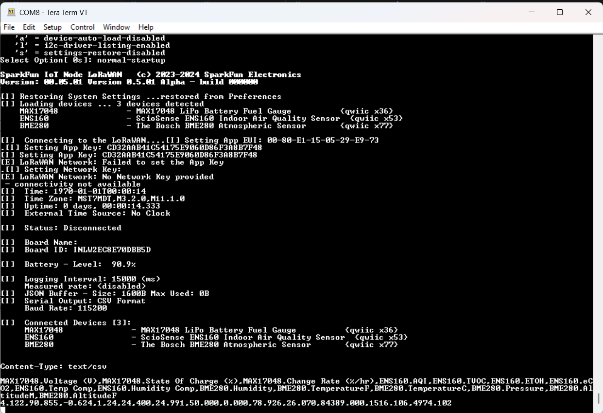
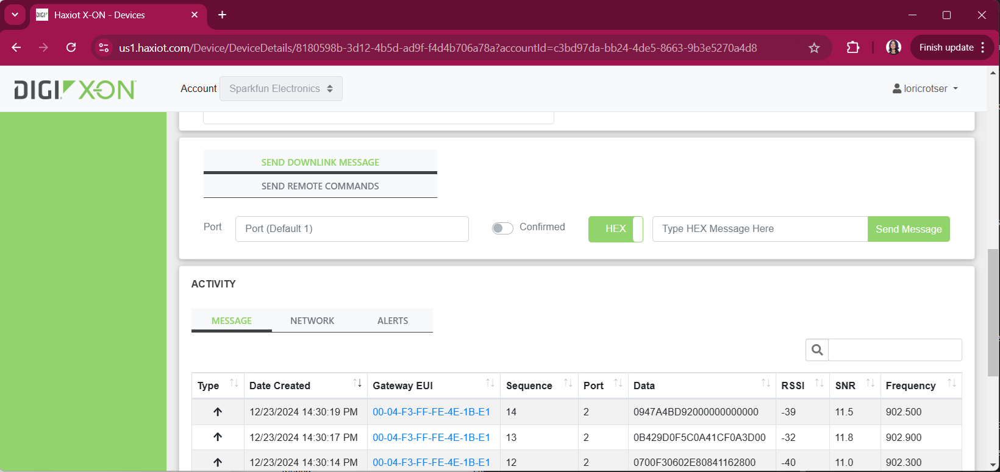

-    <a href="https://www.sparkfun.com/products/26060">
    **SparkFun IoT Node for LoRaWAN®** 
    **SKU:** WRL-26060

    ---

    <figure markdown>
    
    </figure></a>
    
-    The SparkFun IoT Node for LoRaWAN® development board brings an entirely new level of usability to the often convoluted and configuration-intensive effort to set up a LoRaWAN®-based IoT Device. Combining the ease of LoRaWAN® setup and configuration delivered by the Digi X-ON™ system with the rapid prototyping provided by the SparkFun Qwiic ecosystem, the SparkFun IoT Node for LoRaWAN® development board accelerates IoT end-node creation and deployment.

    

    [Purchase from SparkFun :fontawesome-solid-cart-plus:{ .heart }](https://www.sparkfun.com/products/26060){ .md-button .md-button--primary }
    

## Getting Started with Digi

To get started, you'll need to have access to an HX15 Gateway (NA or EU version) and a Digi Account. If you've purchased the kit, a Gateway will be included. Digi has a great ["Getting Started" video here](https://youtu.be/nrmTp8ZYa6c?si=9FnklldcUvFMTXLr). The kit also has a welcome card included that contains a QR Code. Scanning this code will take you to a URL where you can register for an account.

<!--If you've already registered with Digi, go ahead to this link to log in: 

[Digi Login :fontawesome-solid-user:{ .heart }](https://us1.haxiot.com/){ .md-button .md-button--primary }

 

--There are a number of things required to get started, all of which are available in the LoRaWAN kit:

NA version: https://sparkle.sparkfun.com/sparkle/storefront_products/27213#tab-dashboard
EU version: https://sparkle.sparkfun.com/sparkle/storefront_products/27214#tab-dashboard. 

The kit comes with the HX15 Gateway (NA or EU version), IoT Node, antennas, cables, a Qwiic sensor, welcome cards, etc. You'll only need 1 gateway, so once the kit is purchased, expansion only requires the components necessary for additional nodes (SparkFun IoT LoRaWAN Node, antenna, sensors, batteries, etc.).

If you've purchased the kit, there will be a welcome card included that contains a QR Code. Scanning this code will take you to a URL where you can register for an account. 
-->

## Register the LoRaWAN® Node

To provision a device, go to the following link, log in if necessary, and scan the Data Matrix on the XBee. 

[Digi Scan :fontawesome-solid-camera:{ .heart }](https://scan-us1.haxiot.com/){ .md-button .md-button--primary }

<figure markdown>
[{ width="50%" }](assets/img/26883-IoT-Node-LoRaWAN-DataMatrix.jpg "Click to enlarge")
<figcaption markdown>Data Matrix on the XBee</figcaption>
</figure>

!!! note
    If your DataMatrix scan is too blurry to work, wait a few moments and a manual entry will appear. From here you can manually enter the serial number to register your device. Alternatively, the mobile version has a zoom slider.  

    <figure markdown>
    [{ width="40%" }](assets/img/BlurryScan.png "Click to enlarge")
    <figcaption markdown>Manual Entry for XBee Module</figcaption>
    </figure>

      

## Digi Devices

Once you've registered your SparkFun IoT Node for LoRaWAN® board, you'll see it in your devices. Go to **Network Dashboard** -> **Devices**

<figure markdown>
[{ width="75%" }](assets/img/SelectDevices.png "Click to enlarge")
<figcaption markdown>Devices on Digi</figcaption>
</figure>

Make sure you've got the correct Application selected like so: 

<figure markdown>
[{ width="75%" }](assets/img/SelectApplication.png "Click to enlarge")
<figcaption markdown>Application on Digi</figcaption>
</figure>

You'll see your device here. 

<figure markdown>
[{ width="75%" }](assets/img/Digi-XON-DevicesPage_CorrectApplication.png "Click to enlarge")
<figcaption markdown>Devices on Digi</figcaption>
</figure>

## Plug in a Qwiic Sensor

Our [Qwiic Ecosystem](https://www.sparkfun.com/qwiic) has an array of plug and play sensors. For the pre-programmed firmware, you'll need the [SparkFun Environmental Combo Breakout - ENS160/BME280 (Qwiic)](https://www.sparkfun.com/products/22858); plug it into the Qwiic port as shown here: 

<figure markdown>
[{ width="75%" }](assets/img/26060-LoRaWAN-QwiicBoard.jpg "Click to enlarge")
<figcaption markdown>Connecting a Qwiic Sensor to the SparkFun IoT Node for LoRaWAN® Board</figcaption>
</figure>

## Reading Firmware

The SparkFun IoT Node for LoRaWAN® comes with Firmware that allows for a number of settings. By default, you can leave this be, but if you're interested in changing settings or verifying that everything is working you can pull up your favorite terminal (Putty, TeraTerm, etc), connect via serial to the port your LoRaWAN® has enumerated on, and you should see something like the following: 

<figure markdown>
[{ width="75%" }](assets/img/TeraTerm_BaseMenu.png "Click to enlarge")
<figcaption markdown>Connecting with TeraTerm</figcaption>
</figure>

There are a number of different menus and settings you can scroll through at your leisure. 

## Reading Data

If nothing is entered in the above window, the LoRaWAN® will use default settings and start running. 

<figure markdown>
[{ width="75%" }](assets/img/LoRaWAN_Data.png "Click to enlarge")
<figcaption markdown>Reading Data</figcaption>
</figure>

This data will upload to your Digi Account via your gateway and can be seen here under Dashboard / Devices / Device Details: 

<figure markdown>
[{ width="75%" }](assets/img/DigiSiteDataSent.png "Click to enlarge")
<figcaption markdown>Data Packets</figcaption>
</figure>

## Device Details and Management

Clicking on your device's EUI will take you to a page with Device Details, including the packets sent and gateway strength. 

<figure markdown>
[{ width="100%" }](assets/img/DeviceDetails.gif "Click to enlarge")
<figcaption markdown>Device Details Page</figcaption>
</figure>

